# Networking Assessment - Module-5

**1) Capture and analyze ARP packets using Wireshark. Inspect the ARP request and reply frames, and discuss the role of the sender's IP and MAC address in these packets.**

Applied 'arp' filter in Wireshark.
Created traffic using 'ping' command in the terminal:
```bash
ping 192.168.1.8
```
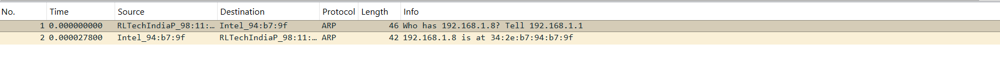

ARP (Address Resolution Protocol) is used to map an IP address to a MAC address within a local network. When a device wants to communicate with another device, it sends an ARP request asking for the MAC address of the target IP. The device with that IP responds with an ARP reply containing its MAC address. ARP allows devices to communicate at the data link layer using physical MAC addresses.

We can find two packets captured:
- ARP request
- ARP reply

**ARP Request:**
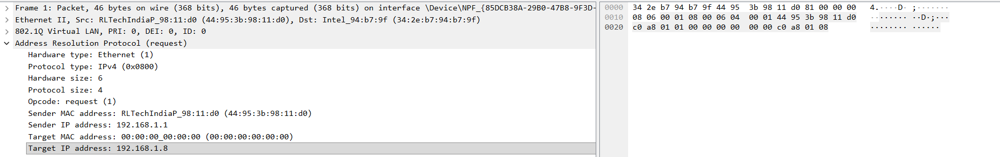

Important fields observed:

| Field | Value |
|-----|-----|
Sender IP Address | 192.168.1.1 |
Sender MAC Address | 44:95:3b:98:11:d0 |
Target IP Address | 192.168.1.8 |
Target MAC Address | 00:00:00:00:00:00 |

The device with IP **192.168.1.1** wants to communicate with **192.168.1.8**, but it does not know its MAC address.  
So it sends a broadcast message asking:

**"Who has 192.168.1.8? Tell 192.168.1.1"**

**ARP Reply:**
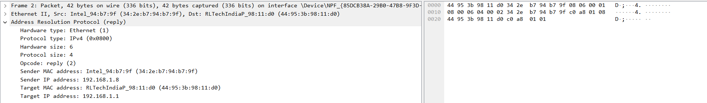

Important fields observed:

| Field | Value |
|-----|-----|
Sender IP Address | 192.168.1.8 |
Sender MAC Address | 34:2e:b7:94:b7:9f |
Target IP Address | 192.168.1.1 |
Target MAC Address | 44:95:3b:98:11:d0 |

The device with IP **192.168.1.8** responds with its MAC address so that the requesting device can send data directly to it.

ARP (Address Resolution Protocol) helps devices in a local network identify the MAC address associated with an IP address.  
In this capture, the device **192.168.1.1** sends an ARP request to find the MAC address of **192.168.1.8**, and the device responds with its MAC address through an ARP reply.

---

2) Using Packet Tracer, simulate an ARP spoofing attack. Analyze the behavior of devices on the network when they receive a malicious ARP response.

# ARP Spoofing Simulation using Packet Tracer

**Network Topology:**
- 1 Switch  
- 3 PCs

Created a LAN using one switch and three PCs in Cisco Packet Tracer ans assigned IP addresses:
   - Victim → 192.168.1.2  
   - Attacker → 192.168.1.100  
   - Gateway → 192.168.1.1  
Checked the arp table after pining the gateway from the victim to check the initial arp table.


Configured the default gateway of the victim as the attacker's IP address (192.168.1.100) to simulate spoofing.

Again check the arp table:

<br>
When a device on a network receives a malicious ARP response, it does not verify the authenticity of the ARP message.

**Observed Behavior:**
**ARP Table Update Without Verification**
   - The device updates its ARP cache with the received IP-to-MAC mapping, even if it is incorrect.
   - This allows an attacker to associate their MAC address with another device’s IP (e.g., gateway).
**Traffic Redirection**
   - The victim starts sending data packets to the attacker instead of the actual destination.
   - This leads to incorrect routing of network traffic.
**Man-in-the-Middle Possibility**
   - The attacker can intercept, monitor, or modify the data being transmitted between devices.
   - Communication appears normal to the victim, making the attack hard to detect.
**Packet Loss or Network Disruption**
   - If the attacker does not forward the packets, communication may fail completely.
   - This results in denial of service-like behavior.
**Duplicate or Abnormal ARP Entries**
   - Multiple IP addresses may map to the same MAC address in the ARP table.
   - This is a key indicator of ARP spoofing.


3) Manually configure static IPs on the client devices(like Pc or your mobile phone) and verify connectivity using ping.

The following static IP configuration was used for the PC:

| Parameter | Value |
|----------|------|
| IP Address | 192.168.1.100 |
| Subnet Mask | 255.255.255.0 |
| Default Gateway | 192.168.1.1 |
| DNS Server | 8.8.8.8 |

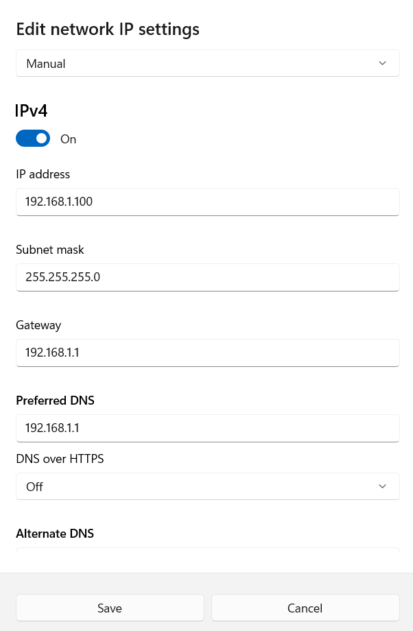

Another device (my mobile phone) was configured with:

| Parameter | Value |
|----------|------|
| IP Address | 192.168.1.101 |
| Subnet Mask | 255.255.255.0 |
| Default Gateway | 192.168.1.1 |
| DNS Server | 8.8.8.8 |

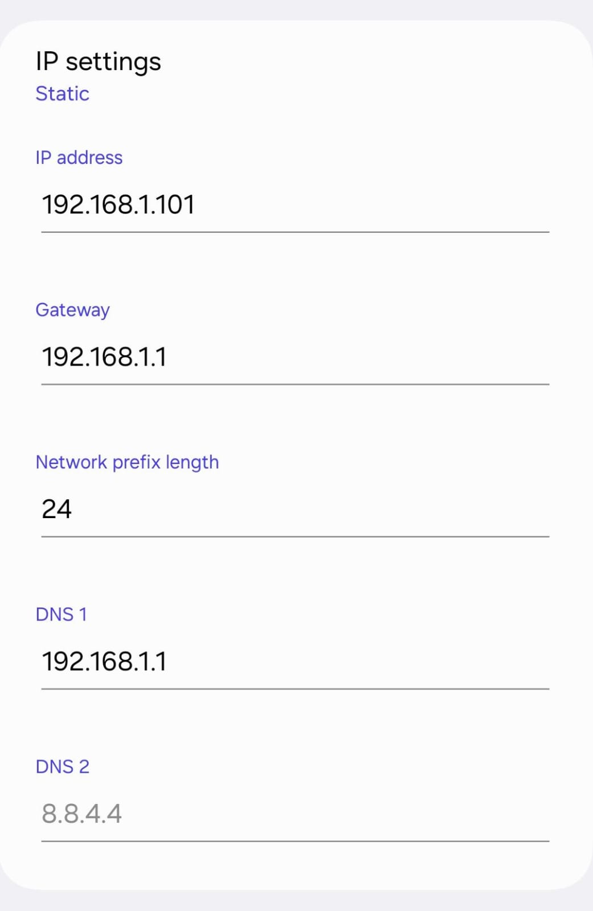

Opened the properties of the active network adapter (Wi-Fi) and selected **Internet Protocol Version 4 (IPv4)**. Entered the static IP address, subnet mask, gateway, and DNS manually. Saved the configuration.

The connectivity between the devices was verified using the ping command through command prompt of PC.
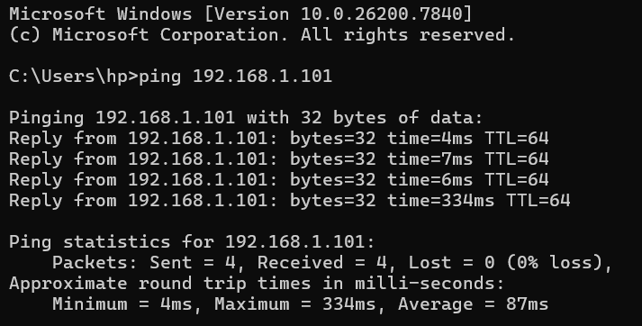


4) Use Wireshark to capture DHCP Discover, Offer, Request, and Acknowledge messages and explain the process.

# DHCP DORA Process Analysis using Wireshark

Started packet capture on the active network interface in Wireshark and applied the 'dhcp' filter.

Tries to capture the DORA process packets by turning the Wi-Fi off and and, but couldnt capture the D and O packets. Only R and A packets were observed. 

So, generated DHCP traffic by releasing and renewing the IP address using:
```bash
ipconfig /release
ipconfig /renew
```
Observed the following captured packets in Wireshark:
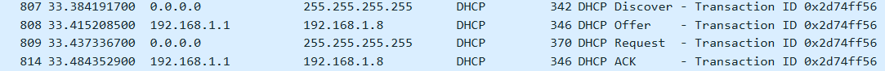

The DHCP protocol follows a four-step process called **DORA**.

### 1. Discover
When a device connects to a network, it does not have an IP address.  
It sends a **DHCP Discover** message as a broadcast to find available DHCP servers.

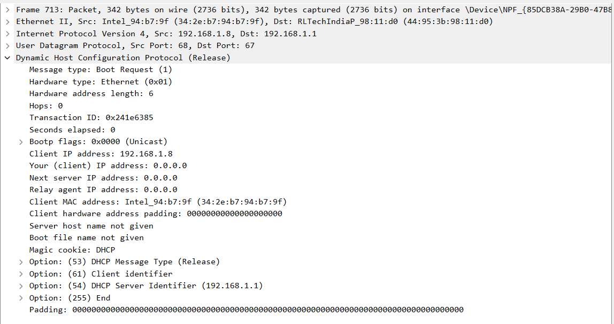

### 2. Offer
The DHCP server responds with a **DHCP Offer** message.  
This message contains an available IP address and other network configuration details.

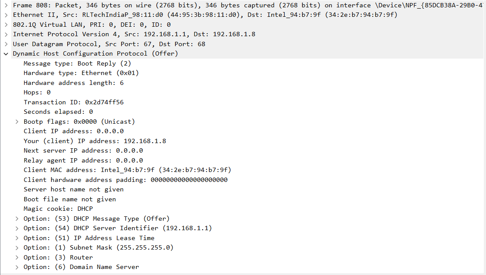

### 3. Request
The client sends a **DHCP Request** message to the server indicating that it wants to use the offered IP address.

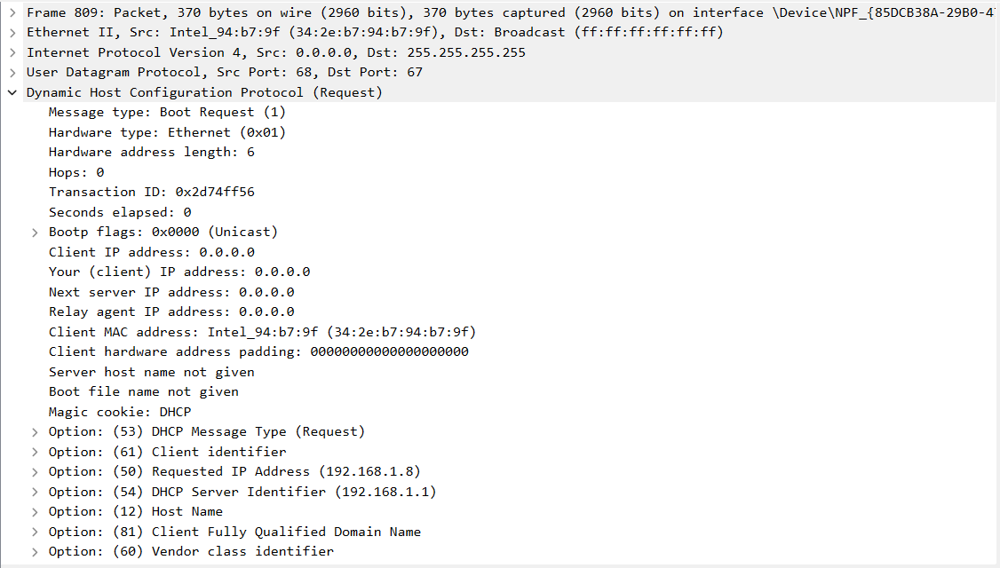

### 4. Acknowledge
Finally, the DHCP server sends a **DHCP Acknowledge (ACK)** message confirming the assignment of the IP address.

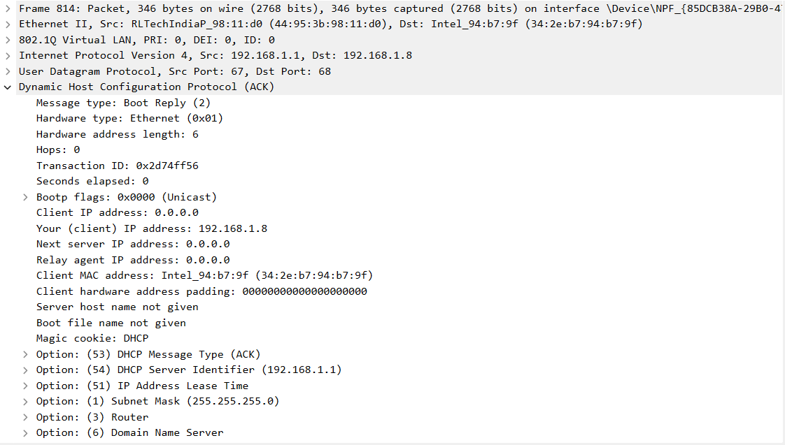

The DORA process allows devices to automatically obtain an IP address and other network settings such as subnet mask, default gateway, and DNS server. This process happens quickly whenever a device connects to a DHCP-enabled network.

The DHCP Discover, Offer, Request, and Acknowledge packets were successfully captured and analyzed using Wireshark.
 
 ---

5) Given an IP address range of 192.168.1.0/24, divide the network into 4 subnets.
Task: Manually calculate the new subnet mask and the range of valid IP addresses for each subnet.
Assign IP addresses from these subnets to devices in Cisco Packet Tracer and verify connectivity using ping between them.

**Given Network Address:** 192.168.1.0/24
**Subnet Mask:** 255.255.255.0
**Total Hosts:** 256

To create 4 subnets, 2 bits are borrowed from the host portion. (2^2 = 4 subnets)
**New subnet prefix:** /26
**New subnet mask:** 255.255.255.192

## Subnet Table

| Subnet | Network Address | First Host | Last Host | Broadcast |
|------|------|------|------|------|
| Subnet 1 | 192.168.1.0 | 192.168.1.1 | 192.168.1.62 | 192.168.1.63 |
| Subnet 2 | 192.168.1.64 | 192.168.1.65 | 192.168.1.126 | 192.168.1.127 |
| Subnet 3 | 192.168.1.128 | 192.168.1.129 | 192.168.1.190 | 192.168.1.191 |
| Subnet 4 | 192.168.1.192 | 192.168.1.193 | 192.168.1.254 | 192.168.1.255 |

Each subnet supports 62 usable host addresses.

**Packet Tracer Implementation:**

The network devices were connected in the following topology:
 - 2 Routers
 - 4 switches (1 switch per subnet)
 - 8 PCs (2 PCs per subnet)

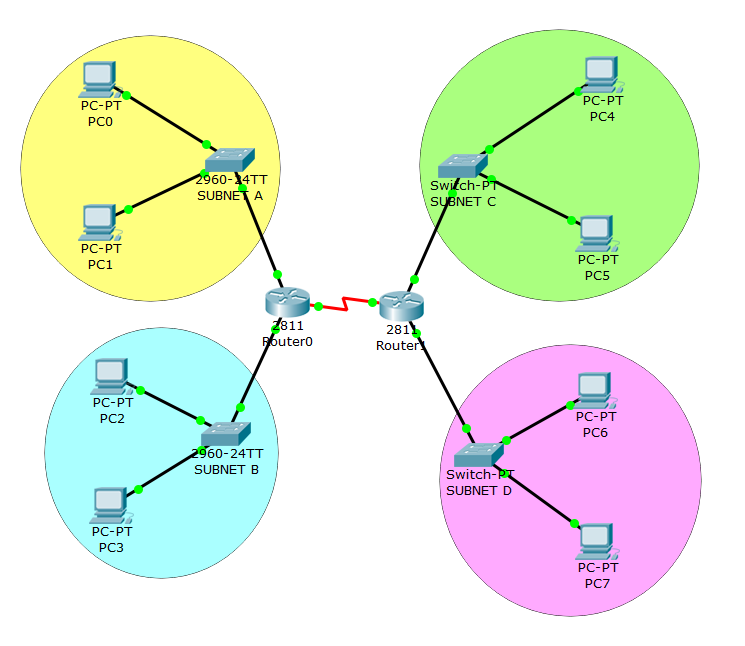

**IP Address Assignment:**

| Subnet | Device | IP Address | Subnet Mask | Default Gateway |
|------|------|------|------|------|
| Subnet 1 | Router0 Interface | 192.168.1.1 | 255.255.255.192 | — |
| Subnet 1 | PC0 | 192.168.1.10 | 255.255.255.192 | 192.168.1.1 |
| Subnet 1 | PC1 | 192.168.1.20 | 255.255.255.192 | 192.168.1.1 |
| Subnet 2 | Router0 Interface | 192.168.1.65 | 255.255.255.192 | — |
| Subnet 2 | PC2 | 192.168.1.70 | 255.255.255.192 | 192.168.1.65 |
| Subnet 2 | PC3 | 192.168.1.80 | 255.255.255.192 | 192.168.1.65 |
| Subnet 3 | Router1 Interface | 192.168.1.129 | 255.255.255.192 | — |
| Subnet 3 | PC4 | 192.168.1.130 | 255.255.255.192 | 192.168.1.129 |
| Subnet 3 | PC5 | 192.168.1.140 | 255.255.255.192 | 192.168.1.129 |
| Subnet 4 | Router1 Interface | 192.168.1.193 | 255.255.255.192 | — |
| Subnet 4 | PC6 | 192.168.1.200 | 255.255.255.192 | 192.168.1.193 |
| Subnet 4 | PC7 | 192.168.1.210 | 255.255.255.192 | 192.168.1.193 |

**Router Configuration:**

Router0 Configuration
```bash
enable
configure terminal
```
```bash
interface g0/0
ip address 192.168.1.1 255.255.255.192
no shutdown
```
```bash
interface g0/1
ip address 192.168.1.65 255.255.255.192
no shutdown
```
```bash
interface g0/2
ip address 10.0.0.1 255.255.255.252
no shutdown
```
Router1 Configuration
```bash
enable
configure terminal
```
```bash
interface g0/0
ip address 192.168.1.129 255.255.255.192
no shutdown
```
```bash
interface g0/1
ip address 192.168.1.193 255.255.255.192
no shutdown
```
```bash
interface g0/2
ip address 10.0.0.2 255.255.255.252
no shutdown
```

**Static Routing Configuration:**

To allow communication between routers and different subnets, static routes were configured.

Router0:
```bash
ip route 192.168.1.128 255.255.255.192 10.0.0.2
ip route 192.168.1.192 255.255.255.192 10.0.0.2
```
Router1:
```bash
ip route 192.168.1.0 255.255.255.192 10.0.0.1
ip route 192.168.1.64 255.255.255.192 10.0.0.1
```
Connectivity was tested using the ping command. <br>
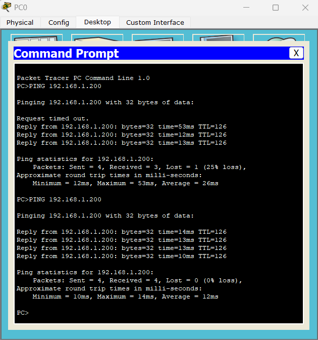
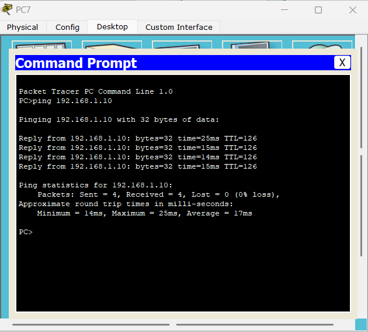
<br>
Successful replies confirm that routing between different subnets is working correctly.

---

6) You are given three IP addresses: 10.1.1.1, 172.16.5.10, and 192.168.1.5.
Task: Identify the class of each IP address (Class A, B, or C). What is the default subnet mask for each class?
Provide the range of IP addresses for each class.

**Given IP Addresses:**
1. 10.1.1.1  
2. 172.16.5.10  
3. 192.168.1.5

**IP Address Classes:**

IP addresses in IPv4 are divided into different classes based on the first octet of the address.

| Class | First Octet Range | Default Subnet Mask |
|------|------------------|---------------------|
| Class A | 1 – 126 | 255.0.0.0 |
| Class B | 128 – 191 | 255.255.0.0 |
| Class C | 192 – 223 | 255.255.255.0 |

**Classification of Given IP Addresses:**

| IP Address | Class | Default Subnet Mask |
|------------|------|---------------------|
| 10.1.1.1 | Class A | 255.0.0.0 |
| 172.16.5.10 | Class B | 255.255.0.0 |
| 192.168.1.5 | Class C | 255.255.255.0 |

**1. 10.1.1.1**
The first octet is **10**, which falls in the range **1–126**, so it belongs to **Class A**.  
The default subnet mask for Class A is **255.0.0.0**.

**2. 172.16.5.10**
The first octet is **172**, which falls in the range **128–191**, so it belongs to **Class B**.  
The default subnet mask for Class B is **255.255.0.0**.

**3. 192.168.1.5**
The first octet is **192**, which falls in the range **192–223**, so it belongs to **Class C**.  
The default subnet mask for Class C is **255.255.255.0**.

---

7) In Cisco Packet Tracer, create a small network with multiple devices (e.g., 2 PCs and a router). Use private IP addresses (e.g., 192.168.1.x) on the PCs and configure the router to perform NAT to allow the PCs to access the internet.
Task: Test the NAT configuration by pinging an external IP address from the PCs and capture the traffic using Wireshark.
What is the source IP address before and after NAT?

Created a network with:
  - 2 PCs (Private IP: 192.168.1.x)
  - 1 Router (performs NAT)
  - 1 Server (acts as Internet)
- Enable communication from private network to external network
- Verify using:
  - `ping`
  - Packet capture (Simulation Mode / Wireshark)

**Topology:**
- 2 PCs
- 1 Switch
- 1 Router
- 1 Server (Internet simulation)


**PCs IP address Configuration:**

| Device | IP Address     | Subnet Mask     | Default Gateway |
|--------|---------------|-----------------|-----------------|
| PC0    | 192.168.1.2  | 255.255.255.0   | 192.168.1.1     |
| PC1    | 192.168.1.3  | 255.255.255.0   | 192.168.1.1     |
| Server    | 200.0.0.2  | 255.255.255.0   | 200.0.0.1     |

**Router Configuration:**

**Inside Interface (LAN):**
```bash
interface fastEthernet0/0
ip address 192.168.1.1 255.255.255.0
ip nat inside
no shutdown
```
**Outside Interface (LAN):**
```bash
interface fastEthernet0/1
ip address 200.0.0.1 255.255.255.0
ip nat outside
no shutdown
```
**Configure NAT:**
```bash
access-list 1 permit 192.168.1.0 0.0.0.255
```
**Enable NAT Overload (PAT):**
```bash
ip nat inside source list 1 interface fastEthernet0/1 overload
```
**Test NAT from PC0 and PC1:**
```bash
ping 200.0.0.2
```
Output:<br>

<br>
**Verify NAT on Router:**
```bash
show ip nat translations
```
Output:<br>

<br>

Simulation of Traffic in Packet Tracer:


Before NAT: Source IP - 192.168.1.2 (Local IP)
After NAT: Source IP - 200.0.0.1 (Public IP)
